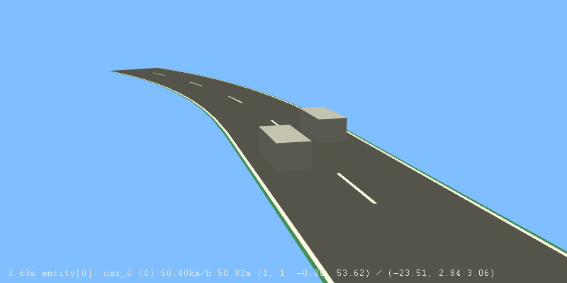
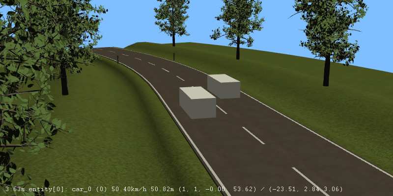
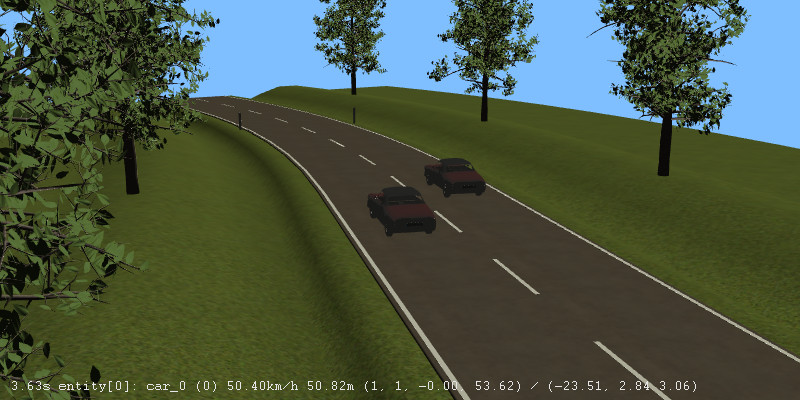
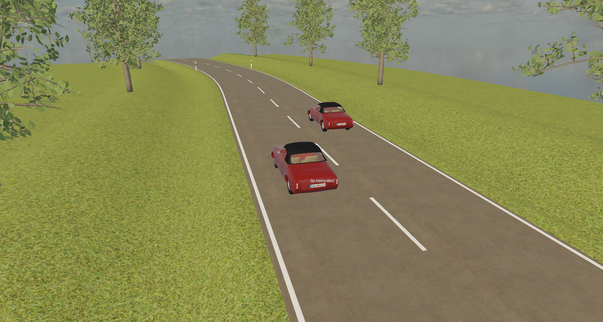

# Scenario example

This example showcases the interaction between ASAM OpenMATERIAL 3D, ASAM OpenDRIVE, ASAM OpenSCENARIO XML, and ASAM OSI.

## ASAM OpenDRIVE

`environment_example.xodr` is an ASAM OpenDRIVE file that corresponds to the environment example ASAM OpenMATERIAL 3D asset, which is also contained in the examples folder.
This means, that the environment example asset shares the same coordinate frame as the corresponding ASAM OpenDRIVE file.
Furthermore, the road network geometry in the asset corresponds to the road network description of the ASAM OpenDRIVE file.

## ASAM OpenSCENARIO XML

The `scenario_example_two_vehicles.xosc` is an ASAM OpenSCENARIO XML file.
The following figure shows the bare scenario with the connected OpenDRIVE map and moving objects as bounding boxes.
It was generated with the scenario player [esmini](https://github.com/esmini/esmini).

The ASAM OpenSCNEARIO file links the ASAM OpenDRIVE file described above as `LogicFile`.
It also links the corresponding ASAM OpenMATERIAL 3D asset as `SceneGraphFile`, so it can be associated with the stationary environment.
This is visualized in the following figure.

The moving entities are described in a separate vehicle catalog, which can be found in `catalogs/vehicles/VehicleCatalog.xosc`.
It contains one vehicle that refers to the ASAM OpenMATERIAL 3D vehicle_example as `model3d`.
The scenario contains two moving objects of the same type, as shown in the following figure.

## ASAM OSI

To showcase the interaction with ASAM OSI, the ASAM OpenSCENARIO XML file described above was played with the scenario player [esmini](https://github.com/esmini/esmini).
The output was stored in an ASAM OSI binary SensorView trace file: `20250130T100644Z_sv_370_2112_700_scenario_example_two_vehicles.osi`.
The ASAM OpenMATERIAL 3D assets linked in the ASAM OpenSCENARIO XML file and the ASAM OpenSCENARIO XML vehicle catalog are contained in the ASAM OSI trace file as model_references.
The figure below was taken with Persival Simspector to visualize the content of the ASAM OSI trace file, including the referenced ASAM OpenMATERIAL 3D assets.

